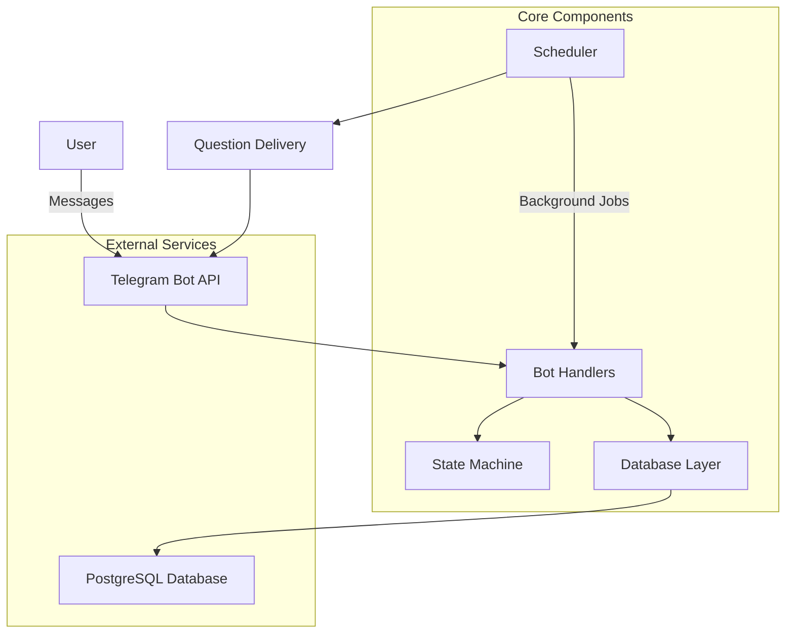
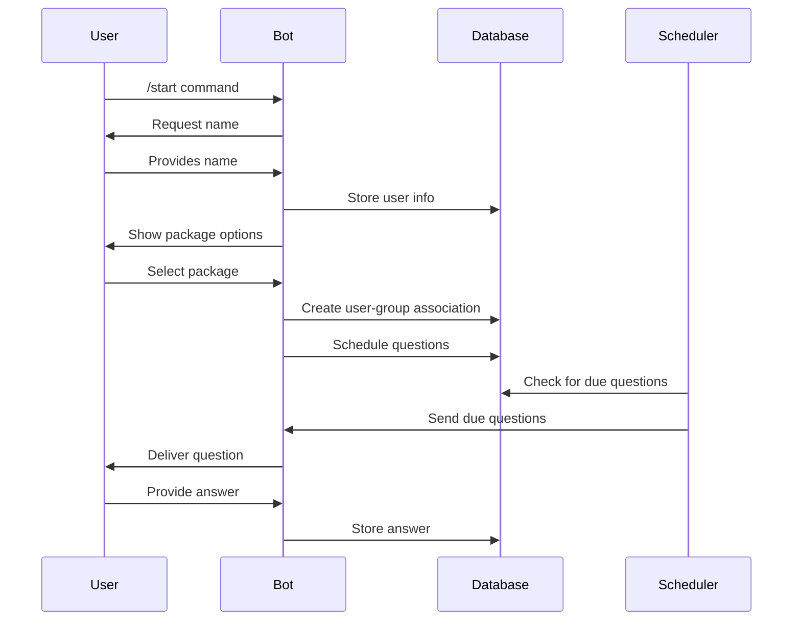

# Telegram Reminder Bot

A sophisticated Telegram bot that sends scheduled questions and reminders to users based on customizable packages. Built with Python, PostgreSQL, and advanced scheduling capabilities.

## 🌟 Features

- **Multi-package Support**: 1-month, 2-month, and 3-month question packages
- **Intelligent Scheduling**: Automated question delivery based on intervals
- **Question Types**: Support for multiple choice and yes/no questions
- **Persistent Storage**: PostgreSQL database for reliable data management
- **Background Processing**: APScheduler for automated reminders
- **State Management**: Conversation flow handling for user interactions
- **Scalable Architecture**: Modular design following SOLID principles

## 🚀 Quick Start

```bash
# Clone the repository
git clone https://github.com/yourusername/telegram-reminder-bot.git
cd telegram-reminder-bot

# Install dependencies
pip install -r requirements.txt

# Set up environment variables
cp .env.example .env
# Edit .env with your configuration

# Run the bot
python src/main.py
```

## 📊 System Architecture



## 🏗️ Project Structure

```
telegram-reminder-bot/
├── src/
│   ├── bot/
│   │   ├── __init__.py
│   │   ├── config.py          # Configuration management
│   │   ├── database.py        # Database operations
│   │   ├── handlers.py        # Message handlers
│   │   ├── scheduler.py       # Background job scheduling
│   │   ├── questions.py       # Question management
│   │   └── utils.py           # Utility functions
│   └── main.py               # Application entry point
├── tests/
│   ├── __init__.py
│   ├── test_database.py      # Database tests
│   ├── test_handlers.py      # Handler tests
│   └── test_scheduler.py     # Scheduler tests
├── docs/
│   ├── installation.md       # Installation guide
│   ├── deployment.md         # Deployment instructions
│   ├── database_schema.md    # Database documentation
│   ├── configuration.md      # Configuration guide
│   ├── api_reference.md      # API documentation
│   └── variables_reference.md # Variable reference
├── requirements.txt          # Python dependencies
├── Procfile                 # Heroku deployment
├── .env.example            # Environment template
└── README.md               # This file
```

## 📚 Documentation

| Document | Description | Link |
|----------|-------------|------|
| **Installation Guide** | Step-by-step setup instructions for all OS | [docs/installation.md](docs/installation.md) |
| **Deployment Guide** | Heroku and other platform deployments | [docs/deployment.md](docs/deployment.md) |
| **Database Schema** | Complete database structure and relationships | [docs/database_schema.md](docs/database_schema.md) |
| **Configuration** | Environment variables and settings | [docs/configuration.md](docs/configuration.md) |
| **API Reference** | Function and class documentation | [docs/api_reference.md](docs/api_reference.md) |
| **Variables Reference** | Complete variable and object documentation | [docs/variables_reference.md](docs/variables_reference.md) |
| **Architecture & File Communication Guide** | Overview of architecture, dependencies, and inter-module communication | [docs/architecture_communication.md](docs/architecture_communication.md) |

## 🔧 Technology Stack

### Core Technologies
- **[Python 3.8+](https://www.python.org/downloads/)** - Main programming language
- **[PostgreSQL](https://www.postgresql.org/)** - Relational database management
- **[pyTelegramBotAPI](https://pypi.org/project/pyTelegramBotAPI/)** - Telegram Bot API wrapper
- **[APScheduler](https://apscheduler.readthedocs.io/)** - Advanced Python Scheduler

### Dependencies
- **[psycopg2-binary](https://pypi.org/project/psycopg2-binary/)** - PostgreSQL adapter for Python
- **[python-dotenv](https://pypi.org/project/python-dotenv/)** - Environment variable management
- **[APScheduler](https://pypi.org/project/APScheduler/)** - Background job scheduling

### Platform Support
- **[Heroku](https://www.heroku.com/)** - Cloud platform deployment
- **[Telegram Bot API](https://core.telegram.org/bots/api)** - Bot communication interface

## 🛠️ Installation

### Prerequisites
- Python 3.8 or higher
- PostgreSQL database
- Telegram Bot Token from [@BotFather](https://t.me/BotFather)

### Platform-Specific Instructions

#### Windows
```powershell
# Install Python from python.org
# Install PostgreSQL from postgresql.org
# Clone and setup
git clone https://github.com/yourusername/telegram-reminder-bot.git
cd telegram-reminder-bot
python -m venv venv
venv\Scripts\activate
pip install -r requirements.txt
```

#### macOS
```bash
# Install dependencies with Homebrew
brew install python postgresql
brew services start postgresql

# Clone and setup
git clone https://github.com/yourusername/telegram-reminder-bot.git
cd telegram-reminder-bot
python3 -m venv venv
source venv/bin/activate
pip install -r requirements.txt
```

#### Linux (Ubuntu/Debian)
```bash
# Install dependencies
sudo apt update
sudo apt install python3 python3-pip python3-venv postgresql postgresql-contrib

# Clone and setup
git clone https://github.com/yourusername/telegram-reminder-bot.git
cd telegram-reminder-bot
python3 -m venv venv
source venv/bin/activate
pip install -r requirements.txt
```

For detailed installation instructions, see [Installation Guide](docs/installation.md).

## ⚙️ Configuration

Create a `.env` file in the project root:

```bash
# Telegram Bot Configuration
BOT_TOKEN=your_telegram_bot_token_here

# PostgreSQL Database Configuration
DB_NAME=telegram_bot
DB_USER=bot_user
DB_PASSWORD=your_secure_password
DB_HOST=localhost
DB_PORT=5432

# Scheduler Settings
QUESTION_CHECK_INTERVAL=5    # minutes
REMINDER_CHECK_INTERVAL=24   # hours
```

For complete configuration details, see [Configuration Guide](docs/configuration.md).

## 🚀 Deployment

### Heroku Deployment (Recommended)

```bash
# Install Heroku CLI
# Login and create app
heroku login
heroku create your-bot-name

# Add PostgreSQL addon
heroku addons:create heroku-postgresql:mini

# Set environment variables
heroku config:set BOT_TOKEN=your_telegram_bot_token

# Deploy
git push heroku main
heroku ps:scale worker=1
```

### Alternative Platforms
- **Railway**: Fast deployment with automatic PostgreSQL
- **DigitalOcean App Platform**: Scalable container deployment
- **Docker**: Containerized deployment for any platform

For comprehensive deployment instructions with visuals, see [Deployment Guide](docs/deployment.md).

## 🏛️ Architecture & Design Patterns

This bot implements several software engineering principles and patterns:

### Design Patterns Used
- **Singleton Pattern**: Configuration and database instances
- **Factory Pattern**: Keyboard and UI component creation
- **Observer Pattern**: Scheduler event handling
- **Repository Pattern**: Database abstraction layer
- **State Machine**: User conversation flow management

### SOLID Principles
- **Single Responsibility**: Each class has one clear purpose
- **Open/Closed**: Extensible without modifying existing code
- **Liskov Substitution**: Proper inheritance hierarchies
- **Interface Segregation**: Focused, minimal interfaces
- **Dependency Inversion**: Abstractions over concrete implementations

### Code Quality Features
- **Type Hints**: Enhanced code readability and IDE support
- **Comprehensive Testing**: Unit tests for all major components
- **Error Handling**: Robust exception management
- **Logging**: Detailed application monitoring
- **Documentation**: Extensive inline and external documentation

## 🧪 Testing

Run the test suite:

```bash
# Run all tests
python -m pytest tests/

# Run specific test file
python -m pytest tests/test_database.py

# Run with coverage
python -m pytest --cov=src tests/
```

### Test Structure
- **Unit Tests**: Individual component testing
- **Integration Tests**: Database and API interaction testing
- **Mock Tests**: External service simulation

## 📊 Database Schema

The bot uses a normalized PostgreSQL database schema with the following main tables:

- **users**: User information and registration data
- **question_groups**: Package definitions (1-month, 2-month, 3-month)
- **questions**: Question templates with types and options
- **user_groups**: User-package associations
- **scheduled_questions**: Question scheduling and delivery tracking
- **user_answers**: User response storage

For complete schema documentation, see [Database Schema Guide](docs/database_schema.md).

## 🔄 Bot Workflow



## 🤝 Contributing

1. Fork the repository
2. Create a feature branch (`git checkout -b feature/amazing-feature`)
3. Commit your changes (`git commit -m 'Add amazing feature'`)
4. Push to the branch (`git push origin feature/amazing-feature`)
5. Open a Pull Request

### Development Setup
```bash
# Clone your fork
git clone https://github.com/yourusername/telegram-reminder-bot.git
cd telegram-reminder-bot

# Create development environment
python -m venv dev-env
source dev-env/bin/activate  # On Windows: dev-env\Scripts\activate

# Install development dependencies
pip install -r requirements.txt
pip install pytest pytest-cov black flake8

# Run tests before committing
python -m pytest
black src/
flake8 src/
```

## 📝 License

This project is licensed under the MIT License - see the [LICENSE](LICENSE) file for details.

## 🐛 Troubleshooting

### Common Issues

1. **Bot Token Invalid**
   ```bash
   # Verify token format: should be like 123456789:ABCDEFghijklmnopqrstuvwxyz
   echo $BOT_TOKEN
   ```

2. **Database Connection Failed**
   ```bash
   # Check PostgreSQL service
   sudo systemctl status postgresql  # Linux
   brew services list | grep postgres  # macOS
   ```

3. **Import Errors**
   ```bash
   # Ensure virtual environment is activated
   which python  # Should point to venv/bin/python
   ```

4. **Heroku Deployment Issues**
   ```bash
   # Check logs
   heroku logs --tail
   
   # Verify environment variables
   heroku config
   ```

## 🔗 Useful Resources

### Documentation
- **[Telegram Bot API](https://core.telegram.org/bots/api)** - Official Telegram Bot API documentation
- **[pyTelegramBotAPI](https://pypi.org/project/pyTelegramBotAPI/)** - Python Telegram Bot API wrapper
- **[PostgreSQL Docs](https://www.postgresql.org/docs/)** - PostgreSQL database documentation
- **[APScheduler](https://apscheduler.readthedocs.io/)** - Advanced Python Scheduler documentation
- **[Heroku Dev Center](https://devcenter.heroku.com/)** - Heroku deployment guides

### Learning Resources
- **[Python Official Tutorial](https://docs.python.org/3/tutorial/)** - Python programming fundamentals
- **[SQL Tutorial](https://www.w3schools.com/sql/)** - Database query language
- **[Design Patterns](https://refactoring.guru/design-patterns)** - Software design patterns
- **[Clean Code](https://www.amazon.com/Clean-Code-Handbook-Software-Craftsmanship/dp/0132350882)** - Code quality principles

---

## Author
**Saad Makki**  
Email: saadmakki116@gmail.com

---
