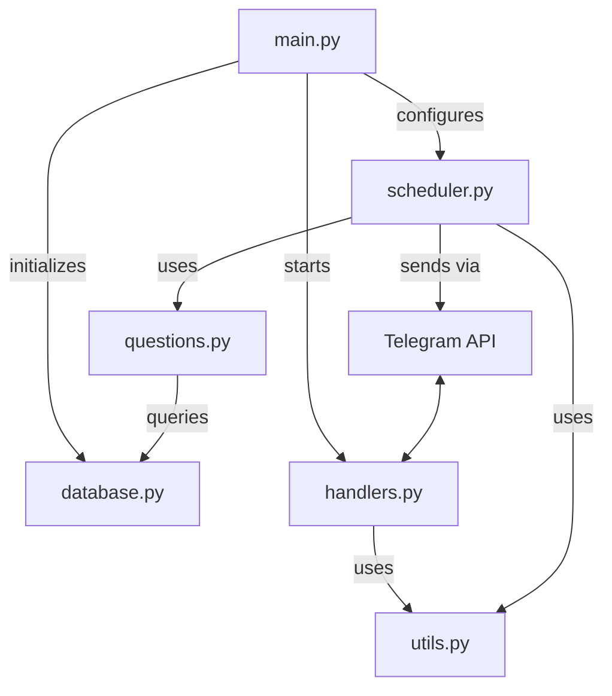
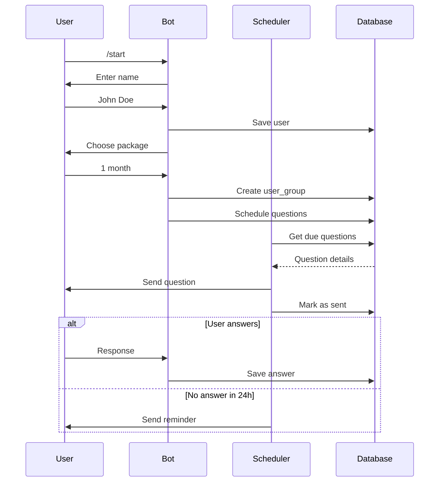

### Project Overview
---
This is a medical follow-up bot that sends scheduled questionnaires to patients, collects responses, and sends reminders for unanswered questions. The system is designed to monitor patient recovery progress over time with configurable treatment packages.

### Core Components Explained
---
#### 1. config.py

**Purpose**: Centralized configuration management  
**Key Features**:
- Loads environment variables from `.env` file
- Provides default values for database settings
- Creates a singleton configuration object
- Calculates PostgreSQL connection parameters dynamically

```python
# Loads environment variables first
load_dotenv()

class Config:
    # Example: BOT_TOKEN = os.getenv("BOT_TOKEN")
    # Sets default DB_HOST="localhost" if not specified
    ...
    
    @property
    def DB_CONFIG(self):
        # Dynamically builds connection parameters
        return {
            "dbname": self.DB_NAME,
            "user": self.DB_USER,
            ...
        }
```

#### 2. database.py
**Purpose**: Database abstraction layer  
**Key Features**:
- Manages PostgreSQL connections
- Creates database schema
- Seeds initial question data
- Implements singleton pattern

```python
class Database:
    def connect(self):
        # Reuses existing connection if available
        if self.conn is None or self.conn.closed:
            self.conn = psycopg2.connect(**config.DB_CONFIG)
    
    def create_tables(self):
        # Executes multiple CREATE TABLE queries
        # Uses REFERENCES for foreign keys
        # Example: user_groups references users(user_id)
    
    def init_question_data(self):
        # Inserts default treatment packages
        # Adds sample questions with different types
```

#### 3. handlers.py
**Purpose**: User interaction management  
**Workflow**:
1. `/start` command initiates registration
2. State machine tracks user progress:
   - `awaiting_name` → `awaiting_package` → active
3. Package selection triggers question scheduling

```python
user_states = {}  # Tracks conversation state

def handle_name(bot, user_id, name):
    # Saves user to database
    # Moves to package selection state

def handle_package(bot, user_id, package):
    # Maps package to group ID
    # Creates user_group record
    # Calls schedule_questions()
    # Sends confirmation message
```

#### 4. scheduler.py
**Purpose**: Background task management  
**Key Jobs**:
1. Question Sender (runs every 5 minutes):
   - Finds due questions (scheduled_time <= NOW())
   - Sends questions with appropriate keyboards
   - Marks questions as sent

2. Reminder Sender (runs every 24 hours):
   - Finds unanswered questions (>24h old)
   - Resends questions as reminders

```python
def send_scheduled_questions(bot: TeleBot):
    # JOINs 4 tables to get question details
    # Uses create_keyboard() for response options
    # Updates sent status in database

def send_reminders(bot: TeleBot):
    # Checks for unanswered questions
    # Resends with "REMINDER:" prefix
```

#### 5. utils.py
**Purpose**: Helper functions  
**Key Functions**:
- `create_keyboard()`: Generates dynamic reply keyboards
- `get_package_options()`: Standard package choices
- `schedule_questions()`: Core scheduling algorithm

```python
def schedule_questions(user_group_id, group_id):
    # Gets all questions for the group
    # Calculates start_date from user_group
    # Generates series: start_date + delay_days + N * interval_days
    # Inserts into scheduled_questions table
```

#### 6. questions.py
**Purpose**: Question data access  
**Key Functions**:
- Getters for question text, type, and options
- Package duration lookup
- Active user group identification

```python
def get_question_text(question_id):
    # Simple SELECT query
    return result[0]['text'] if result else None
```

#### 7. main.py
**Purpose**: Application entry point  
**Execution Flow**:
1. Initialize database (create tables + seed data)
2. Create bot instance
3. Setup message handlers
4. Configure scheduler
5. Start polling in background thread

```python
def main():
    db.create_tables()
    db.init_question_data()
    ...
    # Run bot polling in separate thread
    threading.Thread(target=bot.infinity_polling).start()
```

### Component Interactions
----


### Database Schema Deep Dive
---
**users Table**:
- Stores patient information
- `user_id` as primary key (Telegram chat ID)

**question_groups Table**:
- Defines treatment packages (1/2/3 months)
- `duration_days` determines program length

**questions Table**:
- `type`: "multiple_choice" or "yes_no"
- `options`: JSON array for multiple choice
- `delay_days`: First occurrence delay
- `interval_days`: Repeat interval

**scheduled_questions Table**:
- `scheduled_time`: Exact delivery time
- `sent`: Flag for delivery status
- `sent_time`: Actual delivery timestamp

**user_answers Table**:
- Links answers to specific scheduled questions
- Stores timestamped responses

### Scheduling Algorithm
The core scheduling logic in `schedule_questions()` calculates question dates using:

```
First Occurrence = start_date + delay_days
Subsequent Occurrences = First Occurrence + N * interval_days
```

For example:
- Question with delay_days=2, interval_days=7
- Start date: Jan 1
- Occurrences: Jan 3, Jan 10, Jan 17, ...

### Visual Workflow
---


### Key Design Patterns
---
1. **Singleton Pattern**:
   - Config instance in config.py
   - Database instance in database.py

2. **Factory Pattern**:
   - Keyboard creation based on question type

3. **Observer Pattern**:
   - Scheduler observes time events
   - Triggers question sending

4. **State Pattern**:
   - User state machine in handlers.py

----
Author: Saad Makki\
Email: saadmakki116@gmail.com
