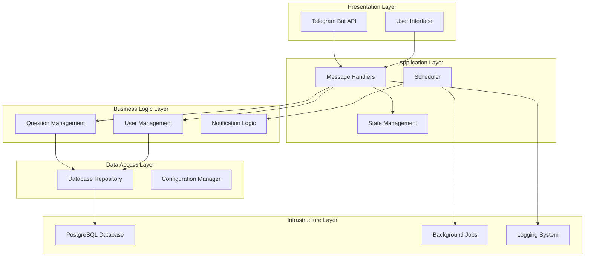
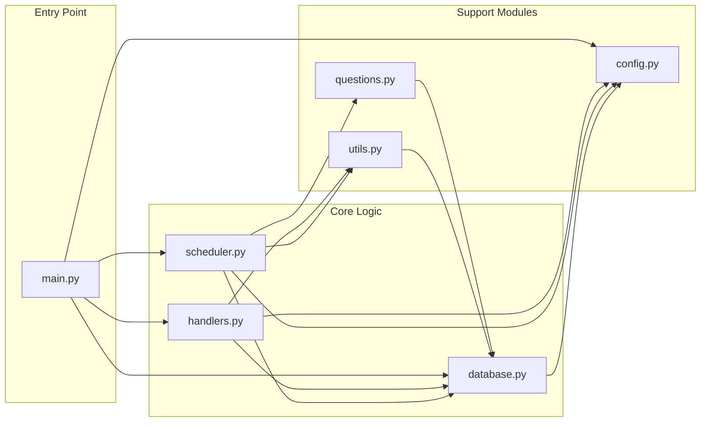
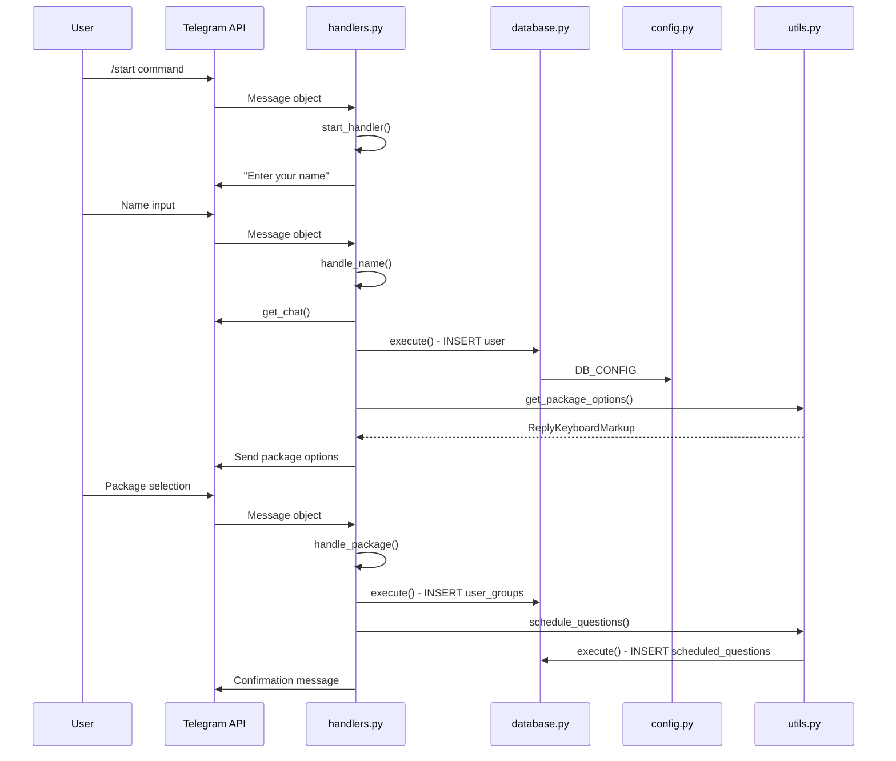
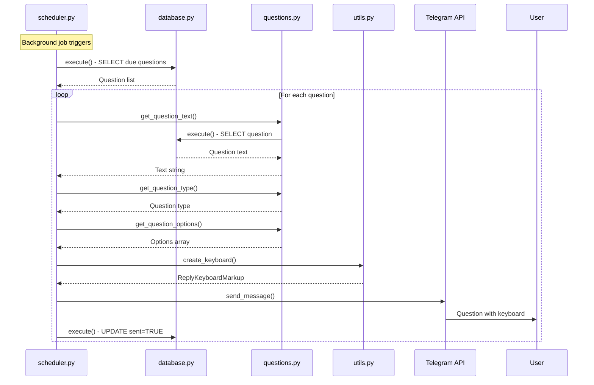
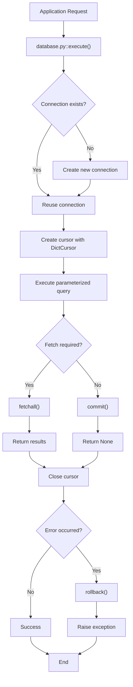
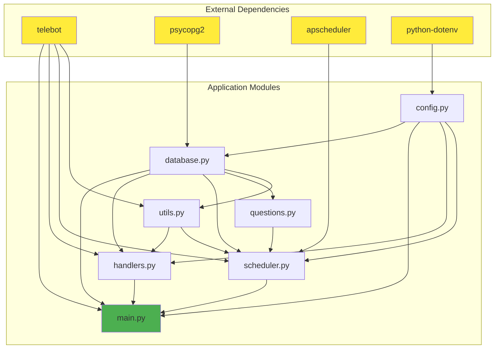
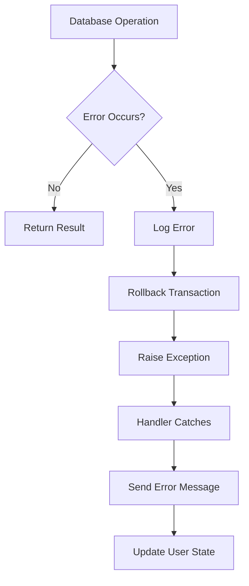

# Architecture and File Communication Guide

This document provides a comprehensive overview of how different files and components in the Telegram Reminder Bot communicate with each other, including visual representations and data flow diagrams.

## Table of Contents
- [System Architecture Overview](#system-architecture-overview)
- [File Communication Matrix](#file-communication-matrix)
- [Data Flow Diagrams](#data-flow-diagrams)
- [Component Interaction Patterns](#component-interaction-patterns)
- [Dependency Graph](#dependency-graph)
- [Communication Protocols](#communication-protocols)

## System Architecture Overview

The Telegram Reminder Bot follows a layered architecture with clear separation of concerns:



## File Communication Matrix

### Direct Dependencies

| Source File | Target File | Communication Type | Purpose |
|-------------|-------------|-------------------|---------|
| `main.py` | `config.py` | Import | Configuration loading |
| `main.py` | `database.py` | Import | Database initialization |
| `main.py` | `handlers.py` | Import | Handler setup |
| `main.py` | `scheduler.py` | Import | Scheduler initialization |
| `handlers.py` | `database.py` | Import | Database operations |
| `handlers.py` | `utils.py` | Import | Utility functions |
| `handlers.py` | `config.py` | Import | Configuration access |
| `scheduler.py` | `database.py` | Import | Database queries |
| `scheduler.py` | `questions.py` | Import | Question retrieval |
| `scheduler.py` | `utils.py` | Import | Keyboard creation |
| `scheduler.py` | `config.py` | Import | Scheduler configuration |
| `database.py` | `config.py` | Import | Database configuration |
| `questions.py` | `database.py` | Import | Database access |
| `utils.py` | `database.py` | Import | Database operations |

### Communication Flow Diagram



## Data Flow Diagrams

### User Registration Flow



### Question Scheduling Flow



### Database Transaction Flow



## Component Interaction Patterns

### 1. Handler Pattern Implementation

```python
# main.py orchestrates the setup
def main():
    # Initialize core components
    db.create_tables()           # Database setup
    bot = TeleBot(config.BOT_TOKEN)  # Bot initialization
    setup_handlers(bot)          # Handler registration
    setup_scheduler(bot)         # Scheduler setup

# handlers.py implements the handler pattern
def setup_handlers(bot: TeleBot):
    @bot.message_handler(commands=['start'])
    def start_handler(message):
        # Handler implementation
        pass
```

### 2. Repository Pattern in Database Layer

```python
# database.py provides data access abstraction
class Database:
    def execute(self, query, params=None, fetch=False):
        # Generic database operations
        pass

# Other modules use the repository
# handlers.py
db.execute("INSERT INTO users (...) VALUES (...)", user_data)

# questions.py
db.execute("SELECT text FROM questions WHERE question_id = %s", (id,))
```

### 3. Factory Pattern in Utils

```python
# utils.py creates UI components
def create_keyboard(question_type, options=None):
    """Factory method for different keyboard types"""
    if question_type == 'yes_no':
        return create_yes_no_keyboard()
    elif question_type == 'multiple_choice':
        return create_multiple_choice_keyboard(options)

# Used by scheduler.py
keyboard = create_keyboard(qtype, options)
bot.send_message(user_id, text, reply_markup=keyboard)
```

## Dependency Graph

### Module Dependencies



### Circular Dependency Prevention

The architecture prevents circular dependencies through:

1. **Layered Architecture**: Clear hierarchy prevents circular imports
2. **Dependency Injection**: Components receive dependencies rather than creating them
3. **Interface Segregation**: Minimal, focused interfaces reduce coupling

## Communication Protocols

### 1. Database Communication Protocol

```python
# Standardized database interaction pattern
class DatabaseProtocol:
    def execute(self, query: str, params: tuple = None, fetch: bool = False):
        """
        Standard database execution protocol
        - query: SQL statement with placeholders
        - params: Parameters for prepared statement
        - fetch: Boolean indicating if results should be returned
        """
        pass

# All database operations follow this protocol
result = db.execute(
    "SELECT * FROM users WHERE user_id = %s",
    (user_id,),
    fetch=True
)
```

### 2. Message Handler Protocol

```python
# Standardized message handling pattern
def message_handler_protocol(bot, message):
    """
    Standard protocol for handling messages:
    1. Extract user information
    2. Validate input
    3. Process business logic
    4. Update database
    5. Send response
    """
    user_id = message.chat.id
    text = message.text.strip()
    
    # Validation
    if not validate_input(text):
        send_error_message(bot, user_id)
        return
    
    # Business logic
    result = process_user_input(user_id, text)
    
    # Database update
    db.execute("UPDATE ...", (user_id, result))
    
    # Response
    bot.send_message(user_id, generate_response(result))
```

### 3. Scheduler Communication Protocol

```python
# Standardized job execution pattern
def scheduler_job_protocol():
    """
    Standard protocol for scheduled jobs:
    1. Query for due tasks
    2. Process each task
    3. Update task status
    4. Handle errors gracefully
    """
    try:
        tasks = db.execute("SELECT ...", fetch=True)
        
        for task in tasks:
            process_task(task)
            mark_task_complete(task['id'])
            
    except Exception as e:
        logger.error(f"Scheduler error: {e}")
```

## Inter-Process Communication

### 1. Thread Safety

```python
# main.py handles threading
def main():
    # Setup scheduler in background thread
    setup_scheduler(bot)
    
    # Bot polling in separate thread
    def polling_thread():
        bot.infinity_polling()
    
    threading.Thread(target=polling_thread, daemon=True).start()
```

### 2. Shared State Management

```python
# handlers.py manages shared state
user_states = {}  # Thread-safe dictionary operations

def update_user_state(user_id, state_data):
    """Thread-safe state updates"""
    with threading.Lock():
        user_states[user_id] = state_data
```

## Error Propagation Patterns

### 1. Database Error Handling



### 2. API Error Handling

```python
# Graceful error handling in handlers
def safe_send_message(bot, user_id, text):
    """Wrapper for safe message sending"""
    try:
        bot.send_message(user_id, text)
    except telebot.apihelper.ApiException as e:
        logger.error(f"API Error: {e}")
        # Implement retry logic or fallback
    except Exception as e:
        logger.error(f"Unexpected error: {e}")
```

## Performance Optimization Patterns

### 1. Connection Pooling

```python
# database.py implements connection reuse
class Database:
    def connect(self):
        """Reuse existing connections when possible"""
        if self.conn is None or self.conn.closed:
            self.conn = psycopg2.connect(**config.DB_CONFIG)
        return self.conn
```

### 2. Batch Processing

```python
# scheduler.py processes multiple items efficiently
def send_scheduled_questions(bot):
    """Batch process all due questions"""
    questions = db.execute("SELECT ... WHERE due", fetch=True)
    
    # Process in batches to avoid overwhelming the API
    for batch in chunk_list(questions, batch_size=10):
        process_question_batch(bot, batch)
        time.sleep(0.1)  # Rate limiting
```

## Monitoring and Observability

### 1. Logging Integration

```python
# Centralized logging configuration
logging.basicConfig(
    level=logging.INFO,
    format='%(asctime)s - %(name)s - %(levelname)s - %(message)s'
)

# Module-specific loggers
logger = logging.getLogger(__name__)
```

### 2. Health Check Endpoints

```python
# Health monitoring across components
def system_health_check():
    """Check health of all components"""
    health_status = {
        "database": check_database_health(),
        "scheduler": check_scheduler_health(),
        "bot_api": check_bot_api_health()
    }
    return health_status
```

## File Communication Summary

The Telegram Reminder Bot demonstrates well-structured inter-module communication through:

1. **Clear Dependencies**: Each module has well-defined responsibilities
2. **Standardized Protocols**: Consistent patterns for database, API, and internal communication
3. **Error Propagation**: Graceful error handling across component boundaries
4. **Resource Sharing**: Efficient sharing of database connections and bot instances
5. **Thread Safety**: Proper handling of concurrent operations
6. **Monitoring**: Comprehensive logging and health checking

This architecture ensures maintainability, scalability, and reliability while following software engineering best practices.

---

## Author
**Saad Makki**  
Email: saadmakki116@gmail.com