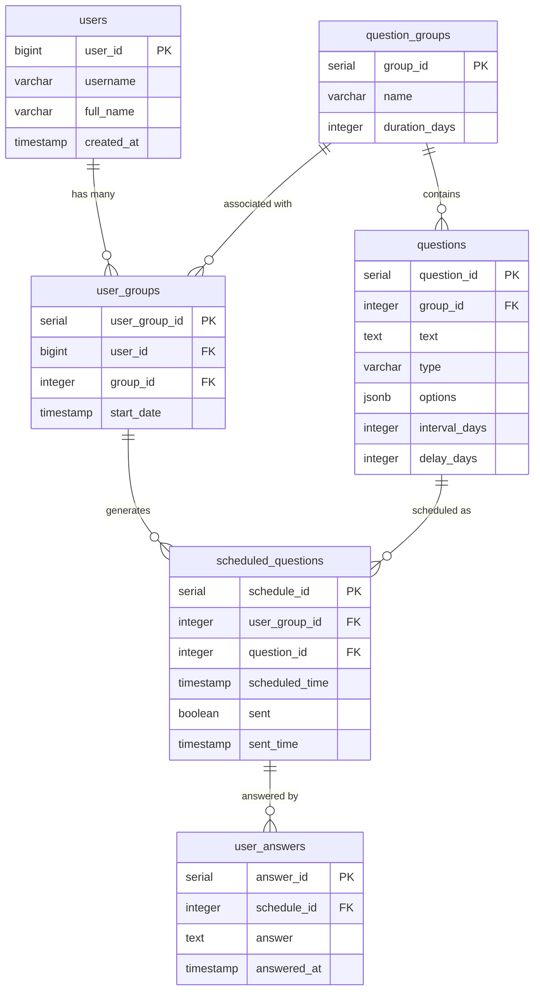
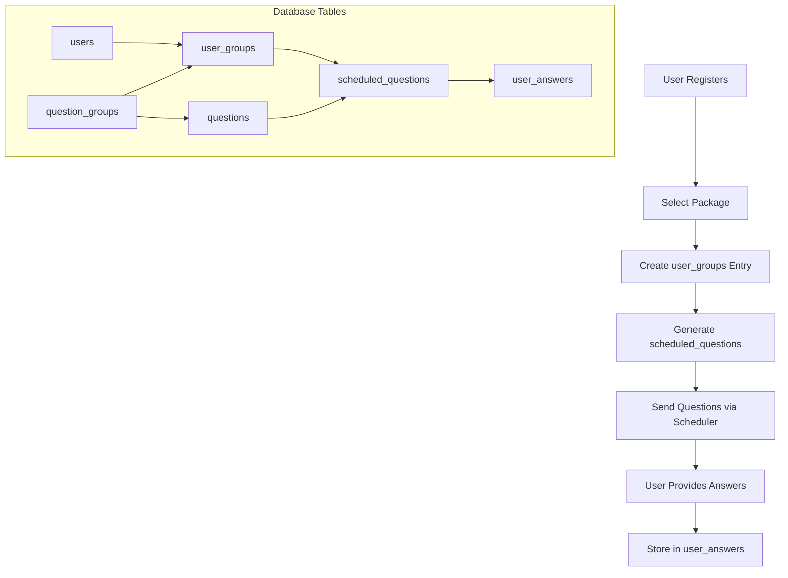

# Database Schema Documentation

This document provides a comprehensive overview of the database schema used by the Telegram Reminder Bot.

## 📊 Database Overview

The bot uses PostgreSQL database with 6 main tables that handle user management, question scheduling, and answer tracking.

### Schema Diagram



## 🗃️ Table Definitions

### 1. users

Stores information about bot users.

```sql
CREATE TABLE users (
    user_id BIGINT PRIMARY KEY,
    username VARCHAR(255),
    full_name VARCHAR(255) NOT NULL,
    created_at TIMESTAMP DEFAULT CURRENT_TIMESTAMP
);
```

| Column | Type | Constraints | Description |
|--------|------|-------------|-------------|
| `user_id` | `BIGINT` | PRIMARY KEY | Telegram user ID |
| `username` | `VARCHAR(255)` | NULLABLE | Telegram username (with @) |
| `full_name` | `VARCHAR(255)` | NOT NULL | User's display name |
| `created_at` | `TIMESTAMP` | DEFAULT NOW() | Registration timestamp |

**Indexes:**
```sql
-- Automatically created for PRIMARY KEY
CREATE INDEX idx_users_username ON users(username);
```

**Sample Data:**
```sql
INSERT INTO users VALUES 
(12345678, '@john_doe', 'John Doe', '2024-01-15 10:30:00'),
(87654321, '@jane_smith', 'Jane Smith', '2024-01-16 14:20:00');
```

### 2. question_groups

Defines different course packages with their durations.

```sql
CREATE TABLE question_groups (
    group_id SERIAL PRIMARY KEY,
    name VARCHAR(255) NOT NULL UNIQUE,
    duration_days INTEGER NOT NULL
);
```

| Column | Type | Constraints | Description |
|--------|------|-------------|-------------|
| `group_id` | `SERIAL` | PRIMARY KEY | Unique group identifier |
| `name` | `VARCHAR(255)` | NOT NULL, UNIQUE | Group name (e.g., "1 month") |
| `duration_days` | `INTEGER` | NOT NULL | Course duration in days |

**Sample Data:**
```sql
INSERT INTO question_groups (name, duration_days) VALUES
('1 month', 30),
('2 months', 60),
('3 months', 90);
```

### 3. questions

Contains all questions for different groups.

```sql
CREATE TABLE questions (
    question_id SERIAL PRIMARY KEY,
    group_id INTEGER REFERENCES question_groups(group_id) ON DELETE CASCADE,
    text TEXT NOT NULL,
    type VARCHAR(20) CHECK (type IN ('multiple_choice', 'yes_no')) NOT NULL,
    options JSONB,
    interval_days INTEGER NOT NULL,
    delay_days INTEGER DEFAULT 0
);
```

| Column | Type | Constraints | Description |
|--------|------|-------------|-------------|
| `question_id` | `SERIAL` | PRIMARY KEY | Unique question identifier |
| `group_id` | `INTEGER` | FOREIGN KEY | References question_groups |
| `text` | `TEXT` | NOT NULL | Question text |
| `type` | `VARCHAR(20)` | CHECK constraint | Question type |
| `options` | `JSONB` | NULLABLE | Multiple choice options |
| `interval_days` | `INTEGER` | NOT NULL | Repeat interval in days |
| `delay_days` | `INTEGER` | DEFAULT 0 | Initial delay before first question |

**Question Types:**
- `yes_no`: Simple yes/no questions
- `multiple_choice`: Questions with predefined options

**Sample Data:**
```sql
INSERT INTO questions (group_id, text, type, options, interval_days, delay_days) VALUES
(1, 'How are you feeling today?', 'multiple_choice', 
 '["Very good", "Good", "Fair", "Poor"]', 1, 0),
(1, 'Did you take your medication?', 'yes_no', NULL, 7, 3),
(2, 'Rate your energy level', 'multiple_choice',
 '["High", "Medium", "Low"]', 3, 1);
```

### 4. user_groups

Links users to their selected course packages.

```sql
CREATE TABLE user_groups (
    user_group_id SERIAL PRIMARY KEY,
    user_id BIGINT REFERENCES users(user_id) ON DELETE CASCADE,
    group_id INTEGER REFERENCES question_groups(group_id) ON DELETE CASCADE,
    start_date TIMESTAMP NOT NULL,
    UNIQUE(user_id, group_id)
);
```

| Column | Type | Constraints | Description |
|--------|------|-------------|-------------|
| `user_group_id` | `SERIAL` | PRIMARY KEY | Unique association ID |
| `user_id` | `BIGINT` | FOREIGN KEY | References users |
| `group_id` | `INTEGER` | FOREIGN KEY | References question_groups |
| `start_date` | `TIMESTAMP` | NOT NULL | When user started the course |

**Sample Data:**
```sql
INSERT INTO user_groups (user_id, group_id, start_date) VALUES
(12345678, 1, '2024-01-15 10:30:00'),
(87654321, 2, '2024-01-16 14:20:00');
```

### 5. scheduled_questions

Tracks when questions should be sent to users.

```sql
CREATE TABLE scheduled_questions (
    schedule_id SERIAL PRIMARY KEY,
    user_group_id INTEGER REFERENCES user_groups(user_group_id) ON DELETE CASCADE,
    question_id INTEGER REFERENCES questions(question_id) ON DELETE CASCADE,
    scheduled_time TIMESTAMP NOT NULL,
    sent BOOLEAN DEFAULT FALSE,
    sent_time TIMESTAMP
);
```

| Column | Type | Constraints | Description |
|--------|------|-------------|-------------|
| `schedule_id` | `SERIAL` | PRIMARY KEY | Unique schedule entry |
| `user_group_id` | `INTEGER` | FOREIGN KEY | References user_groups |
| `question_id` | `INTEGER` | FOREIGN KEY | References questions |
| `scheduled_time` | `TIMESTAMP` | NOT NULL | When to send the question |
| `sent` | `BOOLEAN` | DEFAULT FALSE | Whether question was sent |
| `sent_time` | `TIMESTAMP` | NULLABLE | When question was actually sent |

**Indexes:**
```sql
CREATE INDEX idx_scheduled_questions_time ON scheduled_questions(scheduled_time);
CREATE INDEX idx_scheduled_questions_sent ON scheduled_questions(sent);
CREATE INDEX idx_scheduled_questions_user ON scheduled_questions(user_group_id);
```

### 6. user_answers

Stores user responses to questions.

```sql
CREATE TABLE user_answers (
    answer_id SERIAL PRIMARY KEY,
    schedule_id INTEGER REFERENCES scheduled_questions(schedule_id) ON DELETE CASCADE,
    answer TEXT NOT NULL,
    answered_at TIMESTAMP DEFAULT CURRENT_TIMESTAMP
);
```

| Column | Type | Constraints | Description |
|--------|------|-------------|-------------|
| `answer_id` | `SERIAL` | PRIMARY KEY | Unique answer identifier |
| `schedule_id` | `INTEGER` | FOREIGN KEY | References scheduled_questions |
| `answer` | `TEXT` | NOT NULL | User's answer text |
| `answered_at` | `TIMESTAMP` | DEFAULT NOW() | When answer was given |

## 🔍 Database Relationships

### Relationship Flow



### Foreign Key Relationships

1. **questions.group_id → question_groups.group_id**
   - Each question belongs to a specific group

2. **user_groups.user_id → users.user_id**
   - Links users to their selected packages

3. **user_groups.group_id → question_groups.group_id**
   - Links user selections to question packages

4. **scheduled_questions.user_group_id → user_groups.user_group_id**
   - Links scheduled questions to specific user-group combinations

5. **scheduled_questions.question_id → questions.question_id**
   - Links scheduled instances to actual questions

6. **user_answers.schedule_id → scheduled_questions.schedule_id**
   - Links answers to specific question instances

## 📈 Database Operations

### Common Query Patterns

#### 1. User Registration Flow
```sql
-- Insert new user
INSERT INTO users (user_id, username, full_name, created_at)
VALUES (12345, '@username', 'Full Name', NOW())
ON CONFLICT (user_id) DO UPDATE SET
full_name = EXCLUDED.full_name, username = EXCLUDED.username;

-- Create user-group association
INSERT INTO user_groups (user_id, group_id, start_date)
VALUES (12345, 1, NOW());

-- Get user_group_id for scheduling
SELECT user_group_id FROM user_groups 
WHERE user_id = 12345 ORDER BY start_date DESC LIMIT 1;
```

#### 2. Question Scheduling Logic
```sql
-- Get questions for a specific group
SELECT question_id, interval_days, delay_days 
FROM questions 
WHERE group_id = 1;

-- Generate scheduled questions
INSERT INTO scheduled_questions (user_group_id, question_id, scheduled_time)
VALUES (1, 1, '2024-01-15 10:30:00');
```

#### 3. Daily Question Delivery
```sql
-- Find due questions
SELECT sq.schedule_id, u.user_id, q.question_id, q.text, q.type, q.options
FROM scheduled_questions sq
JOIN user_groups ug ON sq.user_group_id = ug.user_group_id
JOIN users u ON ug.user_id = u.user_id
JOIN questions q ON sq.question_id = q.question_id
WHERE sq.sent = FALSE 
AND sq.scheduled_time <= NOW();

-- Mark question as sent
UPDATE scheduled_questions 
SET sent = TRUE, sent_time = NOW() 
WHERE schedule_id = 1;
```

#### 4. Answer Processing
```sql
-- Find pending question for user
SELECT sq.schedule_id, q.type, q.options
FROM scheduled_questions sq
JOIN user_groups ug ON sq.user_group_id = ug.user_group_id
JOIN questions q ON sq.question_id = q.question_id
WHERE ug.user_id = 12345 
AND sq.sent = TRUE 
AND NOT EXISTS (
    SELECT 1 FROM user_answers ua
    WHERE ua.schedule_id = sq.schedule_id
)
ORDER BY sq.scheduled_time DESC LIMIT 1;

-- Save user answer
INSERT INTO user_answers (schedule_id, answer) 
VALUES (1, 'Very good');
```

#### 5. Reminder System
```sql
-- Find unanswered questions (older than 24h)
SELECT sq.schedule_id, u.user_id, q.question_id, q.text
FROM scheduled_questions sq
JOIN user_groups ug ON sq.user_group_id = ug.user_group_id
JOIN users u ON ug.user_id = u.user_id
JOIN questions q ON sq.question_id = q.question_id
WHERE sq.sent = TRUE
AND sq.sent_time < NOW() - INTERVAL '24 HOURS'
AND NOT EXISTS (
    SELECT 1 FROM user_answers ua
    WHERE ua.schedule_id = sq.schedule_id
);
```

### Performance Optimization Queries

#### Index Creation
```sql
-- Essential indexes for performance
CREATE INDEX CONCURRENTLY idx_scheduled_questions_pending 
ON scheduled_questions(sent, scheduled_time) 
WHERE sent = FALSE;

CREATE INDEX CONCURRENTLY idx_user_groups_user_latest 
ON user_groups(user_id, start_date DESC);

CREATE INDEX CONCURRENTLY idx_user_answers_schedule 
ON user_answers(schedule_id);

-- Composite indexes for complex queries
CREATE INDEX CONCURRENTLY idx_scheduled_questions_user_sent 
ON scheduled_questions(user_group_id, sent, scheduled_time);
```

#### Analytics Queries
```sql
-- User engagement statistics
SELECT 
    u.full_name,
    COUNT(sq.schedule_id) as questions_sent,
    COUNT(ua.answer_id) as questions_answered,
    ROUND(COUNT(ua.answer_id)::numeric / COUNT(sq.schedule_id) * 100, 2) as response_rate
FROM users u
JOIN user_groups ug ON u.user_id = ug.user_id
JOIN scheduled_questions sq ON ug.user_group_id = sq.user_group_id
LEFT JOIN user_answers ua ON sq.schedule_id = ua.schedule_id
WHERE sq.sent = TRUE
GROUP BY u.user_id, u.full_name
ORDER BY response_rate DESC;

-- Question popularity
SELECT 
    q.text,
    COUNT(sq.schedule_id) as times_sent,
    COUNT(ua.answer_id) as times_answered
FROM questions q
LEFT JOIN scheduled_questions sq ON q.question_id = sq.question_id
LEFT JOIN user_answers ua ON sq.schedule_id = ua.schedule_id
GROUP BY q.question_id, q.text
ORDER BY times_sent DESC;
```

## 🔧 Database Maintenance

### Backup Strategies

#### Daily Backup Script
```bash
#!/bin/bash
# backup_db.sh

DB_NAME="telegram_bot"
DB_USER="bot_user"
BACKUP_DIR="/backups"
DATE=$(date +%Y%m%d_%H%M%S)

# Create backup
pg_dump -h localhost -U $DB_USER $DB_NAME > $BACKUP_DIR/backup_$DATE.sql

# Compress backup
gzip $BACKUP_DIR/backup_$DATE.sql

# Clean old backups (keep last 30 days)
find $BACKUP_DIR -name "backup_*.sql.gz" -mtime +30 -delete

echo "Backup completed: backup_$DATE.sql.gz"
```

#### Restore Process
```bash
# Restore from backup
gunzip -c /backups/backup_20240115_120000.sql.gz | psql -h localhost -U bot_user telegram_bot
```

### Data Cleanup

#### Archive Old Data
```sql
-- Archive answered questions older than 6 months
CREATE TABLE user_answers_archive AS 
SELECT * FROM user_answers 
WHERE answered_at < NOW() - INTERVAL '6 months';

-- Delete archived data from main table
DELETE FROM user_answers 
WHERE answered_at < NOW() - INTERVAL '6 months';

-- Archive old scheduled questions
CREATE TABLE scheduled_questions_archive AS
SELECT sq.* FROM scheduled_questions sq
JOIN user_answers ua ON sq.schedule_id = ua.schedule_id
WHERE ua.answered_at < NOW() - INTERVAL '6 months';

DELETE FROM scheduled_questions 
WHERE schedule_id IN (
    SELECT schedule_id FROM scheduled_questions_archive
);
```

#### Clean Up Orphaned Records
```sql
-- Find users without any groups
SELECT u.user_id, u.full_name 
FROM users u 
LEFT JOIN user_groups ug ON u.user_id = ug.user_id 
WHERE ug.user_id IS NULL;

-- Find scheduled questions without answers (older than 30 days)
SELECT COUNT(*) 
FROM scheduled_questions sq 
WHERE sq.sent = TRUE 
AND sq.sent_time < NOW() - INTERVAL '30 days'
AND NOT EXISTS (
    SELECT 1 FROM user_answers ua WHERE ua.schedule_id = sq.schedule_id
);
```

## 🔍 Monitoring and Statistics

### Database Health Checks

#### Connection Monitoring
```sql
-- Check active connections
SELECT 
    datname,
    usename,
    application_name,
    state,
    COUNT(*)
FROM pg_stat_activity 
WHERE datname = 'telegram_bot'
GROUP BY datname, usename, application_name, state;
```

#### Table Statistics
```sql
-- Check table sizes
SELECT 
    schemaname,
    tablename,
    pg_size_pretty(pg_total_relation_size(schemaname||'.'||tablename)) as size
FROM pg_tables 
WHERE schemaname = 'public'
ORDER BY pg_total_relation_size(schemaname||'.'||tablename) DESC;

-- Check row counts
SELECT 
    'users' as table_name, COUNT(*) as row_count FROM users
UNION ALL
SELECT 'question_groups', COUNT(*) FROM question_groups  
UNION ALL
SELECT 'questions', COUNT(*) FROM questions
UNION ALL
SELECT 'user_groups', COUNT(*) FROM user_groups
UNION ALL  
SELECT 'scheduled_questions', COUNT(*) FROM scheduled_questions
UNION ALL
SELECT 'user_answers', COUNT(*) FROM user_answers;
```

### Performance Monitoring

#### Slow Query Detection
```sql
-- Enable slow query logging
ALTER SYSTEM SET log_min_duration_statement = 1000; -- Log queries taking >1s
ALTER SYSTEM SET log_statement = 'all';
SELECT pg_reload_conf();

-- Check query performance
SELECT 
    query,
    calls,
    total_time,
    mean_time,
    rows
FROM pg_stat_statements 
ORDER BY total_time DESC 
LIMIT 10;
```

## 🚨 Troubleshooting

### Common Issues and Solutions

#### 1. Connection Issues
```sql
-- Check connection limits
SHOW max_connections;
SELECT COUNT(*) FROM pg_stat_activity;

-- Kill hung connections
SELECT pg_terminate_backend(pid) 
FROM pg_stat_activity 
WHERE datname = 'telegram_bot' 
AND state = 'idle in transaction'
AND state_change < NOW() - INTERVAL '1 hour';
```

#### 2. Constraint Violations
```sql
-- Check for orphaned foreign keys
SELECT 'scheduled_questions with invalid user_group_id' as issue,
       COUNT(*) as count
FROM scheduled_questions sq
LEFT JOIN user_groups ug ON sq.user_group_id = ug.user_group_id
WHERE ug.user_group_id IS NULL

UNION ALL

SELECT 'user_answers with invalid schedule_id' as issue,
       COUNT(*) as count  
FROM user_answers ua
LEFT JOIN scheduled_questions sq ON ua.schedule_id = sq.schedule_id
WHERE sq.schedule_id IS NULL;
```

#### 3. Data Integrity Checks
```sql
-- Verify question scheduling logic
SELECT 
    ug.user_id,
    qg.name as package,
    COUNT(sq.schedule_id) as scheduled_questions,
    MIN(sq.scheduled_time) as first_question,
    MAX(sq.scheduled_time) as last_question
FROM user_groups ug
JOIN question_groups qg ON ug.group_id = qg.group_id
LEFT JOIN scheduled_questions sq ON ug.user_group_id = sq.user_group_id
GROUP BY ug.user_id, ug.user_group_id, qg.name
ORDER BY ug.user_id;
```

## 📋 Migration Scripts

### Schema Updates

#### Adding New Columns
```sql
-- Add timezone support
ALTER TABLE users ADD COLUMN timezone VARCHAR(50) DEFAULT 'UTC';
ALTER TABLE scheduled_questions ADD COLUMN timezone VARCHAR(50) DEFAULT 'UTC';

-- Add question priority
ALTER TABLE questions ADD COLUMN priority INTEGER DEFAULT 1;
```

#### Data Migration Example
```sql
-- Migrate old question format to new format
UPDATE questions 
SET options = '["Yes", "No"]'
WHERE type = 'yes_no' AND options IS NULL;

-- Update existing schedules with timezone
UPDATE scheduled_questions 
SET timezone = 'UTC' 
WHERE timezone IS NULL;
```

---

**Author:** Saad Makki  
**Email:** saadmakki116@gmail.com