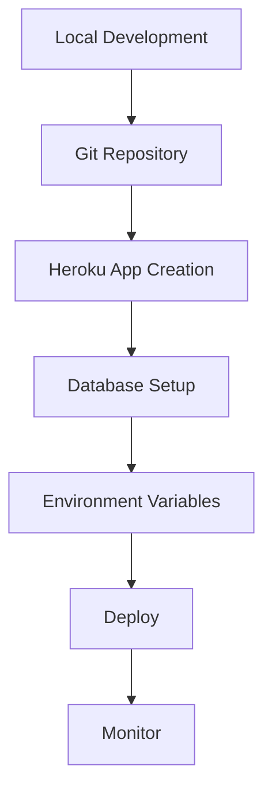
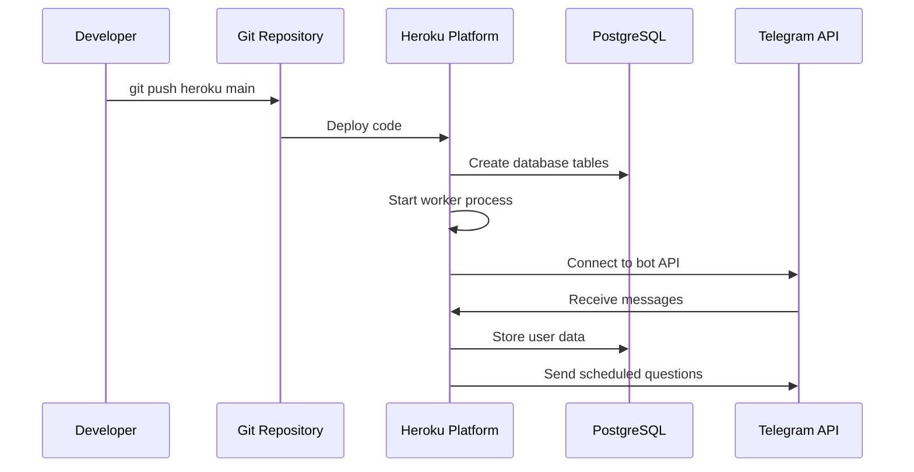
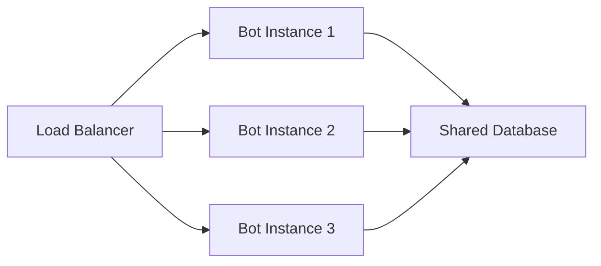

# Deployment Guide

This guide covers deploying the Telegram Reminder Bot to various platforms including Heroku, with step-by-step instructions and visual representations.

## Table of Contents
- [Prerequisites](#prerequisites)
- [Environment Setup](#environment-setup)
- [Heroku Deployment](#heroku-deployment)
- [Alternative Platforms](#alternative-platforms)
- [Monitoring and Maintenance](#monitoring-and-maintenance)
- [Troubleshooting](#troubleshooting)

## Prerequisites

Before deploying, ensure you have:
- Python 3.8+
- Git installed
- A Telegram Bot Token from [@BotFather](https://t.me/BotFather)
- PostgreSQL database access

## Environment Setup

### 1. Environment Variables

Create a `.env` file with the following variables:

```bash
# Telegram Bot Configuration
BOT_TOKEN=your_telegram_bot_token_here

# PostgreSQL Database Configuration
DB_NAME=telegram_bot
DB_USER=bot_user
DB_PASSWORD=your_secure_password
DB_HOST=localhost
DB_PORT=5432

# Scheduler Settings
QUESTION_CHECK_INTERVAL=5    # minutes
REMINDER_CHECK_INTERVAL=24   # hours
```

## Heroku Deployment

### Step 1: Prepare Your Application



### Step 2: Install Heroku CLI

#### Windows
```bash
# Using Chocolatey
choco install heroku-cli

# Or download installer from heroku.com
```

#### macOS
```bash
# Using Homebrew
brew tap heroku/brew && brew install heroku

# Or using installer
curl https://cli-assets.heroku.com/install.sh | sh
```

#### Linux (Ubuntu/Debian)
```bash
# Add Heroku repository
curl https://cli-assets.heroku.com/install-ubuntu.sh | sh

# Or using snap
sudo snap install heroku --classic
```

### Step 3: Login to Heroku

```bash
heroku login
```

### Step 4: Create Heroku Application

```bash
# Navigate to your project directory
cd telegram-reminder-bot

# Initialize git if not already done
git init

# Create Heroku app
heroku create your-bot-name

# Add PostgreSQL addon
heroku addons:create heroku-postgresql:mini
```

### Step 5: Configure Environment Variables

```bash
# Set bot token
heroku config:set BOT_TOKEN=your_telegram_bot_token

# Database variables (auto-set by Heroku Postgres)
# BOT_TOKEN will be set manually
heroku config:set QUESTION_CHECK_INTERVAL=5
heroku config:set REMINDER_CHECK_INTERVAL=24
```

### Step 6: Deploy the Application

```bash
# Add files to git
git add .
git commit -m "Initial deployment"

# Deploy to Heroku
git push heroku main

# Scale worker process
heroku ps:scale worker=1
```

### Visual Deployment Flow



### Step 7: Monitor Deployment

```bash
# View logs
heroku logs --tail

# Check app status
heroku ps

# Open app dashboard
heroku open
```

## Alternative Platforms

### Railway Deployment

#### Step 1: Setup Railway
```bash
# Install Railway CLI
npm install -g @railway/cli

# Login
railway login

# Create project
railway new
```

#### Step 2: Configure Environment
```bash
# Set environment variables
railway variables:set BOT_TOKEN=your_token
railway variables:set DATABASE_URL=your_db_url
```

#### Step 3: Deploy
```bash
# Deploy
railway up
```

### DigitalOcean App Platform

#### Step 1: Create App Spec
Create `app.yaml`:
```yaml
name: telegram-reminder-bot
services:
- name: worker
  source_dir: /
  github:
    repo: your-username/telegram-reminder-bot
    branch: main
  run_command: python src/main.py
  environment_slug: python
  instance_count: 1
  instance_size_slug: basic-xxs
  envs:
  - key: BOT_TOKEN
    scope: RUN_TIME
    value: ${BOT_TOKEN}
databases:
- name: postgres-db
  engine: PG
  version: "13"
```

### Docker Deployment

#### Dockerfile
```dockerfile
FROM python:3.9-slim

WORKDIR /app

COPY requirements.txt .
RUN pip install -r requirements.txt

COPY . .

CMD ["python", "src/main.py"]
```

#### Docker Compose
```yaml
version: '3.8'
services:
  bot:
    build: .
    environment:
      - BOT_TOKEN=${BOT_TOKEN}
      - DB_HOST=postgres
      - DB_NAME=telegram_bot
      - DB_USER=bot_user
      - DB_PASSWORD=${DB_PASSWORD}
    depends_on:
      - postgres
  
  postgres:
    image: postgres:13
    environment:
      - POSTGRES_DB=telegram_bot
      - POSTGRES_USER=bot_user
      - POSTGRES_PASSWORD=${DB_PASSWORD}
    volumes:
      - postgres_data:/var/lib/postgresql/data

volumes:
  postgres_data:
```

## Monitoring and Maintenance

### Health Checks

```python
# Add to main.py for health monitoring
import psutil
import time

def health_check():
    """Simple health check endpoint"""
    try:
        # Check database connection
        db.execute("SELECT 1", fetch=True)
        
        # Check memory usage
        memory = psutil.virtual_memory()
        
        return {
            "status": "healthy",
            "database": "connected",
            "memory_usage": f"{memory.percent}%",
            "timestamp": time.time()
        }
    except Exception as e:
        return {
            "status": "unhealthy",
            "error": str(e),
            "timestamp": time.time()
        }
```

### Logging Configuration

```python
# Enhanced logging setup
import logging
from logging.handlers import RotatingFileHandler

# Configure logging
logging.basicConfig(
    level=logging.INFO,
    format='%(asctime)s - %(name)s - %(levelname)s - %(message)s',
    handlers=[
        logging.StreamHandler(),
        RotatingFileHandler('bot.log', maxBytes=1024*1024*15, backupCount=5)
    ]
)
```

## Troubleshooting

### Common Issues

#### 1. Database Connection Errors
```bash
# Check database status
heroku pg:info

# Reset database
heroku pg:reset DATABASE_URL --confirm your-app-name
```

#### 2. Worker Process Issues
```bash
# Restart worker
heroku ps:restart worker

# Check worker logs
heroku logs --source app[worker]
```

#### 3. Environment Variable Issues
```bash
# List all config vars
heroku config

# Check specific variable
heroku config:get BOT_TOKEN
```

### Debug Mode

Enable debug mode by setting:
```bash
heroku config:set DEBUG=True
```

Add debug logging in your code:
```python
import logging

if os.getenv('DEBUG', False):
    logging.getLogger().setLevel(logging.DEBUG)
    
logger = logging.getLogger(__name__)
logger.debug("Debug message")
```

## Performance Optimization

### Database Optimization

```sql
-- Create indexes for better performance
CREATE INDEX idx_scheduled_questions_time ON scheduled_questions(scheduled_time);
CREATE INDEX idx_scheduled_questions_sent ON scheduled_questions(sent);
CREATE INDEX idx_user_answers_schedule ON user_answers(schedule_id);
```

### Memory Management

```python
# Add memory monitoring
import psutil

def monitor_memory():
    process = psutil.Process()
    memory_info = process.memory_info()
    logger.info(f"Memory usage: {memory_info.rss / 1024 / 1024:.2f} MB")
```

## Security Best Practices

### Environment Variables
- Never commit `.env` files
- Use strong passwords
- Rotate tokens regularly

### Database Security
```python
# Use parameterized queries (already implemented)
db.execute("SELECT * FROM users WHERE user_id = %s", (user_id,))

# Never use string formatting for SQL
# BAD: f"SELECT * FROM users WHERE user_id = {user_id}"
```

### Bot Token Protection
```python
# Validate bot token format
import re

def validate_bot_token(token):
    pattern = r'^\d+:[A-Za-z0-9_-]{35}$'
    return bool(re.match(pattern, token))
```

## Scaling Considerations

### Horizontal Scaling



### Database Scaling
- Use connection pooling
- Implement read replicas for heavy read operations
- Consider database partitioning for large datasets

---

## Author
**Saad Makki**  
Email: saadmakki116@gmail.com